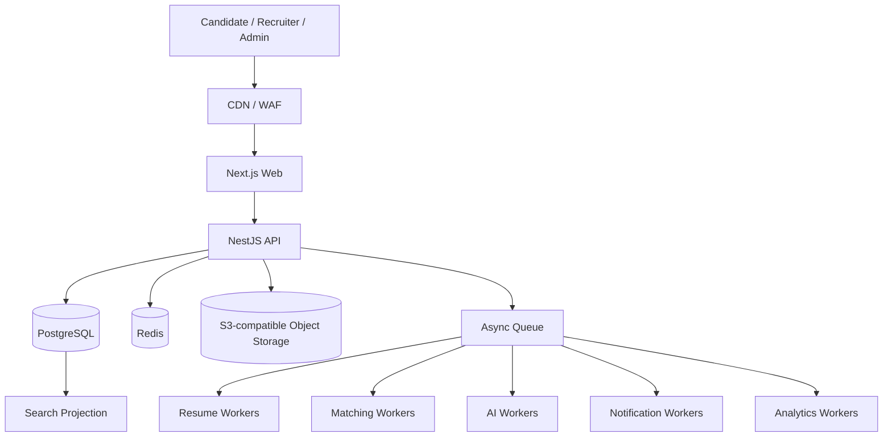

# Talent Network

> **An intelligent hiring network connecting companies with verified, relevant talent.**

Talent Network is a documentation-led, production-oriented employment operating system designed around structured hiring signal, explainable matching, reusable candidate data, and high-quality recruiter workflows.

## Project Status

| Area                                   | Status                         |
| -------------------------------------- | ------------------------------ |
| Product blueprint                      | ✅ Complete                    |
| Architecture baseline                  | ✅ Complete                    |
| Security / scale / data specifications | ✅ Complete                    |
| UX / information architecture          | ✅ Complete                    |
| Monorepo bootstrap                     | ✅ Complete                    |
| Engineering foundation                 | ✅ Complete                    |
| Phase 1 backend foundation             | ✅ Verified                    |
| Phase 1 authenticated web experience   | ✅ Verified                    |
| Career Passport initial foundation     | ✅ Quality gate green          |
| Identity / workspace context hardening | 🟡 Current cross-cutting step |
| Career Passport expansion              | ⏳ Next                        |
| Resume Intelligence                    | ⏳ Next major phase            |

**Current implementation phase:** Phase 2 — Candidate Career Passport, with identity/workspace-context hardening inserted before expanding the Passport surface.

Phase 1 is closed after repository quality-gate verification plus browser-tested signup/login, organization onboarding, email verification, password recovery, invitation acceptance/revocation, multi-workspace switching, and permission-aware owner/recruiter behavior.

The initial Phase 2 Career Passport foundation now has a green repository quality gate, including Phase 2 database-backed integration coverage for initialization, versioned professional-profile updates, section preservation, experience/education versioning, and privacy state remaining separate from profile versions. Browser verification for the final onboarding/context behavior remains part of the active hardening work.

The repository is the single source of truth for product, design, engineering, architecture, infrastructure, security, AI, UX, and deployment decisions.

---

## Product Thesis

Talent Network is not intended to be another generic job board. It is designed as a multi-sided employment platform combining:

- Talent marketplace
- Applicant Tracking System (ATS)
- Talent CRM
- Resume intelligence
- Explainable candidate-job matching
- Assessments and interview workflows
- Candidate career intelligence
- Trust, verification, and hiring analytics

Initial market focus is Pakistan, while the architecture remains capable of evolving toward Gulf, international remote, and enterprise hiring use cases.

### Product promises

**Candidate:** Apply where you genuinely have a strong chance.  
**Employer:** Review relevant people instead of manually screening hundreds of resumes.  
**Platform:** Convert fragmented employment data into reusable, explainable, structured hiring signal.

---

## Identity Model

Talent Network does **not** permanently classify a user as either a candidate or an employer.

A `User` is the authenticated human identity. Candidate and organization participation are independent contexts that can coexist:

```text
User
├── Candidate?                 personal career context
└── OrganizationMember[]      zero or more hiring contexts
    └── Organization
```

A founder can maintain a private Career Passport while owning an organization. A recruiter can belong to several organizations. A candidate can accept a recruiter invitation without creating a second account.

Onboarding therefore asks what the person wants to do now:

```text
Build my career
Hire talent
```

The choice is not permanent, and the other context can be added later.

Active UI context is navigation state only. Server-side candidate ownership, organization membership, tenant scope, and permission evaluation remain authoritative for every protected operation.

See:

- [`docs/10-decisions/ADR-0002-user-context-not-account-type.md`](./docs/10-decisions/ADR-0002-user-context-not-account-type.md)
- [`docs/03-architecture/identity-and-workspace-context.md`](./docs/03-architecture/identity-and-workspace-context.md)
- [`docs/07-design/onboarding-and-context-switching.md`](./docs/07-design/onboarding-and-context-switching.md)

---

## Engineering North Star

Every implementation decision must preserve or improve:

1. **Scalability** — scale without unnecessary rewrites.
2. **Reusability** — shared domain capabilities are composed, not copied.
3. **Maintainability** — explicit boundaries, contracts, ownership, and documentation.
4. **Modularity** — domains remain separable even while initially deployed together.
5. **Evolvability** — complexity is introduced only when measured need justifies it.
6. **Security by design** — tenant isolation, authorization, auditability, and privacy are foundational.
7. **Human-controlled AI** — AI assists and explains; people retain consequential hiring decisions.
8. **Documentation as code** — architectural changes are incomplete until documentation agrees.

See [`AGENTS.md`](./AGENTS.md) for mandatory contributor and coding-agent rules.

---

## Runtime Architecture

We begin with a **modular monolith plus independently scalable workers** rather than premature microservices.



Interactive traffic and heavy computational traffic are intentionally separated. Resume processing, malware scanning, matching, AI inference, notifications, exports, and analytics should not block normal HTTP requests.

---

## Monorepo

```text
apps/
├── web/            Next.js product application
├── api/            NestJS API
├── worker/         asynchronous/background processing
└── scheduler/      recurring and maintenance workflows

packages/
├── config/         runtime-specific validated configuration
├── contracts/      shared transport/API contracts
├── database/       Prisma/PostgreSQL ownership
└── observability/  structured logging foundation
```

Additional domain packages are created only when implementation genuinely needs them. Empty future-domain packages are intentionally avoided.

### Current infrastructure

```text
PostgreSQL  → transactional source of truth
Redis       → cache, coordination and queue infrastructure
RustFS      → local S3-compatible object storage
Prisma      → migrations and database client
pnpm        → workspace/package management
Turborepo   → repository task orchestration
```

RustFS is a **local infrastructure choice**, not an application dependency. Application code must use the generic S3-compatible storage contract so production storage can later move to RustFS, AWS S3, Cloudflare R2, or another validated S3-compatible provider without rewriting business logic.

See [`docs/05-infrastructure/object-storage.md`](./docs/05-infrastructure/object-storage.md).

---

## Local Development

### Requirements

- Node.js 24.x
- pnpm 11.x
- Docker with Docker Compose

The repository currently standardizes on pnpm `11.18.0` through the root `packageManager` field while accepting compatible pnpm 11 releases via the engine range.

### Bootstrap

```bash
cp .env.example .env
docker compose up -d
pnpm install
pnpm dev
```

Local services:

```text
Web               http://localhost:3000
API               http://localhost:4000
PostgreSQL        localhost:5432
Redis             localhost:6379
RustFS S3 API     http://localhost:9000
RustFS Console    http://localhost:9001
```

The local RustFS container uses the same generic `S3_*` credentials consumed by the application. The Compose stack initializes its named data volume permissions before RustFS starts because RustFS runs as a non-root user.

The intended development bucket is:

```text
talent-network-local
```

Bucket provisioning will be automated alongside the storage adapter/resume-upload implementation. Production bucket creation belongs to infrastructure provisioning rather than normal API startup.

### API health contract

```text
GET /api/v1/health/live
GET /api/v1/health/ready
```

`live` proves that the process is alive. `ready` verifies dependencies required to serve traffic, currently PostgreSQL and Redis.

---

## Quality Gate — No Paid CI Required

The project does **not** require GitHub Actions or a paid CI provider.

The authoritative quality gate lives inside the repository:

```bash
pnpm check
```

It runs:

```text
format check
→ lint
→ typecheck
→ unit/security tests
→ Phase 1 PostgreSQL integration tests
→ Phase 2 Career Passport integration tests
→ production build
```

The integration stages deploy committed Prisma migrations before running isolated database-backed suites. Local PostgreSQL therefore needs to be reachable for the complete gate.

A hosted CI provider may be added later, but it should only execute these repository-owned commands. Quality logic must never depend on a specific CI vendor.

See [`docs/11-implementation/local-quality-gates.md`](./docs/11-implementation/local-quality-gates.md).

> Never report a check as passing unless it was actually executed.

---

## Documentation Index

### Product

- [`docs/02-product/master-blueprint.md`](./docs/02-product/master-blueprint.md)

### Architecture

- [`docs/03-architecture/engineering-principles.md`](./docs/03-architecture/engineering-principles.md)
- [`docs/03-architecture/system-overview.md`](./docs/03-architecture/system-overview.md)
- [`docs/03-architecture/domain-architecture.md`](./docs/03-architecture/domain-architecture.md)
- [`docs/03-architecture/data-architecture.md`](./docs/03-architecture/data-architecture.md)
- [`docs/03-architecture/event-architecture.md`](./docs/03-architecture/event-architecture.md)
- [`docs/03-architecture/multi-tenancy-and-authorization.md`](./docs/03-architecture/multi-tenancy-and-authorization.md)
- [`docs/03-architecture/identity-and-workspace-context.md`](./docs/03-architecture/identity-and-workspace-context.md)

### API

- [`docs/08-api/api-architecture.md`](./docs/08-api/api-architecture.md)

### AI & Intelligent Processing

- [`docs/04-ai/resume-processing-architecture.md`](./docs/04-ai/resume-processing-architecture.md)
- [`docs/04-ai/matching-screening-architecture.md`](./docs/04-ai/matching-screening-architecture.md)
- [`docs/04-ai/ai-gateway-and-cost-controls.md`](./docs/04-ai/ai-gateway-and-cost-controls.md)

### Infrastructure

- [`docs/05-infrastructure/load-capacity-model.md`](./docs/05-infrastructure/load-capacity-model.md)
- [`docs/05-infrastructure/deployment-observability.md`](./docs/05-infrastructure/deployment-observability.md)
- [`docs/05-infrastructure/object-storage.md`](./docs/05-infrastructure/object-storage.md)

### Security

- [`docs/06-security/threat-model.md`](./docs/06-security/threat-model.md)

### Design & UX

- [`docs/07-design/design-system.md`](./docs/07-design/design-system.md)
- [`docs/07-design/information-architecture.md`](./docs/07-design/information-architecture.md)
- [`docs/07-design/onboarding-and-context-switching.md`](./docs/07-design/onboarding-and-context-switching.md)
- [`docs/07-design/employer-workspace-ux.md`](./docs/07-design/employer-workspace-ux.md)
- [`docs/07-design/candidate-experience-ux.md`](./docs/07-design/candidate-experience-ux.md)
- [`docs/07-design/admin-trust-ux.md`](./docs/07-design/admin-trust-ux.md)

### Data

- [`docs/09-data/erd-and-entity-contracts.md`](./docs/09-data/erd-and-entity-contracts.md)

### Architecture Decisions

- [`docs/10-decisions/ADR-0001-modular-monolith-first.md`](./docs/10-decisions/ADR-0001-modular-monolith-first.md)
- [`docs/10-decisions/ADR-0002-user-context-not-account-type.md`](./docs/10-decisions/ADR-0002-user-context-not-account-type.md)

### Implementation

- [`docs/11-implementation/mvp-implementation-plan.md`](./docs/11-implementation/mvp-implementation-plan.md)
- [`docs/11-implementation/local-quality-gates.md`](./docs/11-implementation/local-quality-gates.md)
- [`docs/11-implementation/phase-1-closure.md`](./docs/11-implementation/phase-1-closure.md)
- [`docs/11-implementation/phase-2-career-passport.md`](./docs/11-implementation/phase-2-career-passport.md)
- [`docs/11-implementation/identity-context-hardening.md`](./docs/11-implementation/identity-context-hardening.md)

---

## Core Architecture Decisions

- Modular monolith first; extraction only when scaling, ownership, reliability, or compliance justifies it.
- `User` is the human identity; Candidate and organization membership are independent, combinable contexts rather than permanent account types.
- Active workspace/context selection is navigation state, never an authorization grant.
- PostgreSQL is transactional truth.
- Redis is ephemeral infrastructure, never permanent business truth.
- Files belong in private object storage rather than relational blobs.
- Object-storage application code targets a provider-neutral S3-compatible interface; RustFS is the local development provider.
- Heavy processing is asynchronous and retry-safe.
- Reliable business-event publication uses transactional outbox semantics.
- Matching uses hard constraints + structured features + semantic relevance + evidence before expensive LLM reasoning.
- Match results preserve strengths, gaps, uncertainty, conflicts, versions, and evidence—not only a score.
- AI access is centralized behind a provider-neutral gateway.
- Tenant isolation and authorization are enforced on the backend.
- Candidate privacy is distinct from employer permissions and organization membership.
- Important hiring inputs are versioned so historical decisions remain explainable.
- Search, caches, analytics, embeddings, and read projections remain rebuildable derivatives.
- Employer workflows are table-first, high-density, saved-view capable, and split-pane oriented.
- Candidate UX is calmer, document-like, and guidance-first.

---

## Implementation Sequence

```text
0 Engineering Foundation                       ✅ complete
        ↓
1 Identity + Organizations + Permissions       ✅ complete
        ↓
2 Candidate Career Passport foundation         ✅ initial gate green
        ↓
2A Identity / Workspace Context Hardening      ← current
        ↓
2B Career Passport expansion
        ↓
3 Resume Intelligence
        ↓
4 Employer + Jobs
        ↓
5 Job Discovery
        ↓
6 Applications
        ↓
7 Matching / Screening
        ↓
8 Recruiter Applicant Workspace
        ↓
9 Interviews + Notifications
        ↓
10 Admin / Verification / Moderation
        ↓
11 Billing Foundation
        ↓
Production Hardening / MVP Launch
```

The context-hardening insertion is intentionally small and cross-cutting. It prevents the temporary development behavior of implicitly creating Candidate state from becoming a permanent account-type assumption.

Implementation must follow [`docs/11-implementation/mvp-implementation-plan.md`](./docs/11-implementation/mvp-implementation-plan.md) plus the active [`docs/11-implementation/identity-context-hardening.md`](./docs/11-implementation/identity-context-hardening.md) plan. Significant deviations require documentation updates and, when consequential, an ADR.

---

## Definition of Done

> A feature is not complete when the code works. It is complete when code, tests, observability, security implications, architecture documentation, API contracts, and user workflow documentation agree.

---

## License

A license has not yet been selected. Until one is explicitly added, no open-source license is granted.
