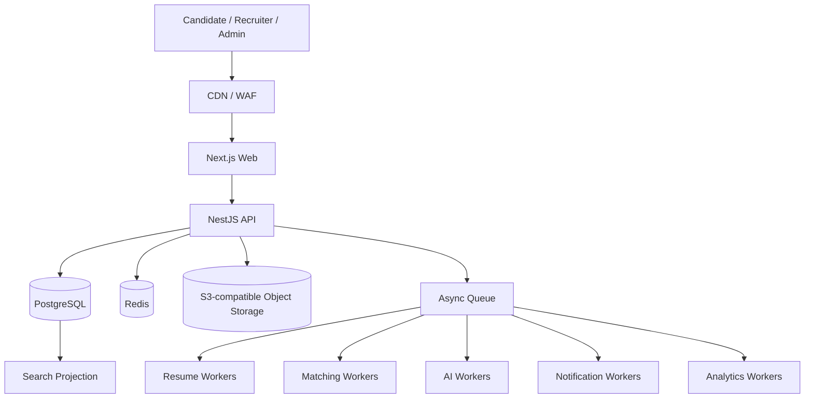

# Talent Network

> **An intelligent hiring network connecting companies with verified, relevant talent.**

Talent Network is a documentation-led, production-oriented employment operating system designed around structured hiring signal, explainable matching, reusable candidate data, and high-quality recruiter workflows.

## MVP Delivery Tracker

> **This is a living implementation tracker, not a marketing roadmap.** Keep it synchronized with verified repository state while developing. A checkbox moves to complete only after its phase/slice quality gate is actually verified; implementation alone is not enough. Detailed acceptance criteria remain in [`docs/11-implementation/mvp-implementation-plan.md`](./docs/11-implementation/mvp-implementation-plan.md) and the phase-specific implementation documents.

### Current position

```text
0 Engineering Foundation                    ✅ VERIFIED
1 Identity + Organizations                  ✅ VERIFIED
2 Candidate Career Passport                 ✅ VERIFIED
  2A Identity / Workspace Context           ✅ VERIFIED
  2B Career Passport Expansion              ✅ VERIFIED
3 Resume Intelligence                       🟡 IN PROGRESS
  3A Resume Domain + Processing Contract    ✅ VERIFIED
  3B Private Object Storage + Upload        ✅ VERIFIED
  3C Validation + Malware Scanning          ✅ VERIFIED
  3D Extraction + OCR                       🟡 CURRENT
    3D-A Contracts + Persistence            ✅ VERIFIED
    3D-B Native PDF/DOCX Extraction         ✅ VERIFIED
    3D-C Quality Routing                    ✅ VERIFIED
    3D-D OCR Fallback                       🟡 IMPLEMENTED / APP-RUNTIME VERIFICATION
    3D-E Runtime Closure                    🟡 CURRENT ACCEPTANCE
  3E Structured Parsing + Evidence          ⬜ REMAINING
  3F Candidate Review Workspace             ⬜ REMAINING
4 Employer + Jobs                           ⬜ REMAINING
5 Job Discovery                             ⬜ REMAINING
6 Applications                              ⬜ REMAINING
7 Matching / Screening V1                   ⬜ REMAINING
8 Recruiter Applicant Workspace             ⬜ REMAINING
9 Interviews + Notifications                ⬜ REMAINING
10 Admin / Verification / Moderation        ⬜ REMAINING
11 Billing Foundation                       ⬜ REMAINING
MVP Production Hardening + Launch           ⬜ REMAINING
```

### Phase 0 — Engineering Foundation · ✅ Verified

- [x] pnpm/Turborepo monorepo and shared TypeScript configuration
- [x] formatting, linting, typecheck, tests and production-build quality gates
- [x] PostgreSQL, Redis and local S3-compatible object storage
- [x] environment validation, migrations, structured logging and health/readiness endpoints
- [x] API, Web, Worker and Scheduler runtime boundaries
- [x] local-first verification workflow; hosted CI remains optional rather than an MVP dependency

### Phase 1 — Identity + Organizations · ✅ Verified

- [x] signup/login/logout and rotating session foundation
- [x] email verification and password recovery
- [x] organization creation, membership and invitations
- [x] reusable permission evaluation and tenant enforcement
- [x] multi-workspace switching and permission-aware navigation
- [x] audit/outbox and authentication rate-limit foundations
- [x] backend integration and browser acceptance coverage

### Phase 2 — Candidate Career Passport · ✅ Verified

- [x] canonical structured Candidate identity
- [x] versioned professional profile state
- [x] experience, education and extensible Passport sections
- [x] privacy state separated from professional versions
- [x] Candidate/Organization privacy firewall
- [x] Career vs Organization context hardening without permanent account type
- [x] Candidate Workspace shell, version history and evidence indicators
- [x] Phase 2A and Phase 2B regression/browser acceptance

### Phase 3 — Resume Intelligence · 🟡 In progress

**3A — Resume domain + processing contract · ✅ Verified**

- [x] candidate-owned Resume / immutable ResumeVersion foundation
- [x] explicit processing state machine and pipeline version
- [x] candidate ownership and cross-candidate isolation

**3B — Private object storage + direct upload · ✅ Verified**

- [x] provider-neutral S3 adapter
- [x] private presigned upload/download
- [x] upload completion metadata verification
- [x] local RustFS browser CORS bootstrap

**3C — Validation + malware scanning · ✅ Verified**

- [x] PDF/DOCX structural validation
- [x] ClamAV adapter and isolated `resume.scan` queue
- [x] checksum generation
- [x] bounded retry/terminal failure semantics
- [x] infected-file logical quarantine and download denial
- [x] clean and EICAR runtime acceptance

**3D — Extraction + OCR · 🟡 Current**

- [x] ResumeDocument/source-range contracts
- [x] deterministic extraction quality policy
- [x] derived ResumeExtraction persistence and idempotency boundary
- [x] native PDF.js adapter with real page identity
- [x] native DOCX adapter without fabricated pagination
- [x] private `resume.extract` asynchronous handoff and worker foundation
- [x] worker processor/state/idempotency/privacy tests
- [x] real generated PDF/DOCX extraction fixtures
- [x] deterministic sufficient-text → `PARSING` routing
- [x] text-poor/scanned-like → `OCR_REQUIRED` routing
- [x] provider-neutral OCR engine, scheduler dispatcher and OCR worker path
- [x] bounded transient OCR-service retry handling
- [x] HTTP OCR adapter with response/time/size/page limits
- [x] local FastAPI + PyMuPDF + Tesseract OCR sidecar
- [x] real local OCR container health check
- [x] real image-only scanned-PDF OCR smoke test (`332` recognized characters on page 1)
- [x] deterministic scanned fixture materialized for application acceptance
- [x] complete repository `pnpm check` green after OCR implementation
- [ ] verify persisted application path `OCR_REQUIRED → candidate.resume.ocr_required → resume.ocr → OCR ResumeExtraction COMPLETED → PARSING`
- [ ] verify runtime logs/audit/outbox contain no raw OCR text during that real path
- [ ] close Phase 3D runtime quality gate

> **UI boundary:** Resume upload/history/review navigation is intentionally not part of the current Career UI yet. That product surface belongs to **Phase 3F — Candidate Review Workspace** after structured parsing/evidence work in Phase 3E. Phase 3D runtime closure uses the real backend/storage/outbox/queue pipeline rather than an invented UI route.

**3E — Structured parsing + evidence mapping · ⬜ Remaining**

- [ ] schema-validated structured resume parser
- [ ] AI Gateway integration where semantic interpretation is useful
- [ ] provenance/confidence and evidence mapping
- [ ] parser outputs remain proposals, never authoritative Passport mutations

**3F — Candidate review workspace · ⬜ Remaining**

- [ ] Resume destination in Candidate Workspace navigation
- [ ] resume upload/history/list and processing progress
- [ ] review proposed Career Passport changes
- [ ] current Passport vs proposed-value comparison
- [ ] Accept / Edit / Ignore workflow
- [ ] accepted changes use normal Passport versioning
- [ ] browser acceptance for complete upload → review journey

### Phase 4 — Employer + Jobs · ⬜ Remaining

- [ ] organization/company profile and verification-state foundation
- [ ] structured job drafts and requirements
- [ ] required/preferred criteria, compensation and work-mode policy
- [ ] screening questions and hiring pipeline selection
- [ ] publish/unpublish/close lifecycle and job versions
- [ ] public job projection/page with tenant-safe internal separation

### Phase 5 — Job Discovery · ⬜ Remaining

- [ ] server-side job search and structured filters
- [ ] indexed PostgreSQL search foundation
- [ ] cursor pagination and URL-backed search state
- [ ] job detail and candidate-safe company information
- [ ] basic recommendation retrieval
- [ ] responsive candidate discovery UX

### Phase 6 — Applications · ⬜ Remaining

- [ ] idempotent application submission
- [ ] immutable submitted Career Passport snapshot
- [ ] pinned submitted ResumeVersion
- [ ] screening answers and application stage/history
- [ ] candidate application timeline
- [ ] employer applicant projection with strict tenant boundaries

### Phase 7 — Matching / Screening V1 · ⬜ Remaining

- [ ] hard eligibility and structured requirement matching
- [ ] experience/role relevance and preference compatibility
- [ ] semantic representation behind explicit versioned contracts
- [ ] candidate evidence and confidence separated from score
- [ ] versioned/reproducible scoring results
- [ ] evidence-linked AI explanations without opaque AI auto-rejection

### Phase 8 — Recruiter Applicant Workspace · ⬜ Remaining

- [ ] dense applicant table and purpose-built list endpoint
- [ ] filters, sorting and cursor loading
- [ ] configurable columns foundation
- [ ] split-pane candidate detail preserving list context
- [ ] stage moves, shortlist, notes and activity
- [ ] keyboard workflow and authorization for every row/action

### Phase 9 — Interviews + Notifications · ⬜ Remaining

- [ ] interview scheduling model, participants and status
- [ ] candidate-safe interview details
- [ ] queued/idempotent email and in-app notifications
- [ ] timezone and retry/failure behavior
- [ ] internal-note privacy guarantees

### Phase 10 — Admin / Verification / Moderation · ⬜ Remaining

- [ ] user/organization operational lookup
- [ ] company verification queue
- [ ] job moderation
- [ ] audit explorer foundation
- [ ] support-safe account context
- [ ] separately authorized and audited admin actions

### Phase 11 — Billing Foundation · ⬜ Remaining

- [ ] plans and entitlements model
- [ ] provider-neutral subscription adapter
- [ ] verified/idempotent billing webhooks
- [ ] feature entitlement enforcement
- [ ] billing audit trail

### MVP Production Hardening + Launch · ⬜ Remaining

- [ ] realistic performance fixtures and load validation
- [ ] applicant-list, job-search, application-burst and resume-queue load tests
- [ ] worker/queue failure and recovery verification
- [ ] backup/restore and deployment/rollback runbooks
- [ ] production observability/alerts and operational dashboards
- [ ] security/privacy/tenant regression pass
- [ ] critical browser/E2E journeys
- [ ] architecture/API/README/ADR consistency audit

### Beyond MVP — intentionally separate

These are architectural future seams, **not unfinished MVP work**: advanced Talent CRM, assessment marketplace, sophisticated scorecards, offer approvals, referrals, salary intelligence, Private Talent Mode, workflow automation builder, Slack/Teams integrations, SSO/SCIM, HRIS integrations, campus/university portals, native mobile apps, a dedicated search cluster, event-streaming platform and Kubernetes. They should be promoted into the MVP only when customer validation or measured scale justifies them.

### Mandatory tracker maintenance

For every implementation slice, contributors and coding agents must:

1. Read this tracker and the relevant phase document before changing code.
2. Keep the current phase/slice marked `🟡` while implementation or verification is incomplete.
3. Mark an item `[x]` only when repository evidence proves it is implemented.
4. Mark a phase/slice `✅ VERIFIED` only after its required unit/integration/security/browser/runtime quality gates have passed as applicable.
5. If a regression invalidates a completed gate, reopen the checkbox/status rather than leaving stale green documentation.
6. Update this README, the detailed implementation document, architecture/API/schema/event docs, and ADRs in the same change whenever their contracts change.
7. Never claim a local check, runtime acceptance, migration, browser journey, or production behavior passed unless its output was actually observed.

The repository is the single source of truth for product, design, engineering, architecture, infrastructure, security, AI, UX, deployment decisions, and implementation status.

---

## Product Thesis

Talent Network is not intended to be another generic job board. It is designed as a multi-sided employment platform combining:

- Talent marketplace
- Applicant Tracking System (ATS)
- Talent CRM
- Resume intelligence
- Explainable candidate-job matching
- Assessments and interview workflows
- Candidate career intelligence
- Trust, verification, and hiring analytics

Initial market focus is Pakistan, while the architecture remains capable of evolving toward Gulf, international remote, and enterprise hiring use cases.

### Product promises

**Candidate:** Apply where you genuinely have a strong chance.  
**Employer:** Review relevant people instead of manually screening hundreds of resumes.  
**Platform:** Convert fragmented employment data into reusable, explainable, structured hiring signal.

### Privacy promise

Career and Hiring are separate data-ownership contexts even when the same person uses both.

> **Your Career identity is personal. Joining a company workspace does not give that company access to your private Career Passport.**

Future application flows cross that boundary only through explicit candidate submission/consent and organization-owned application snapshots. See [`docs/06-security/candidate-organization-privacy-firewall.md`](./docs/06-security/candidate-organization-privacy-firewall.md).

---

## Identity Model

Talent Network does **not** permanently classify a user as either a candidate or an employer.

A `User` is the authenticated human identity. Candidate and organization participation are independent contexts that can coexist:

```text
User
├── Candidate?                 personal career context
└── OrganizationMember[]      zero or more hiring contexts
    └── Organization
```

A founder can maintain a private Career Passport while owning an organization. A recruiter can belong to several organizations. A candidate can accept a recruiter invitation without creating a second account.

Onboarding therefore asks what the person wants to do now:

```text
Build my career
Hire talent
```

The choice is not permanent, and the other context can be added later.

Active UI context is navigation state only. Server-side candidate ownership, organization membership, tenant scope, and permission evaluation remain authoritative for every protected operation.

See:

- [`docs/10-decisions/ADR-0002-user-context-not-account-type.md`](./docs/10-decisions/ADR-0002-user-context-not-account-type.md)
- [`docs/03-architecture/identity-and-workspace-context.md`](./docs/03-architecture/identity-and-workspace-context.md)
- [`docs/07-design/onboarding-and-context-switching.md`](./docs/07-design/onboarding-and-context-switching.md)

---

## Engineering North Star

Every implementation decision must preserve or improve:

1. **Scalability** — scale without unnecessary rewrites.
2. **Reusability** — shared domain capabilities are composed, not copied.
3. **Maintainability** — explicit boundaries, contracts, ownership, and documentation.
4. **Modularity** — domains remain separable even while initially deployed together.
5. **Evolvability** — complexity is introduced only when measured need justifies it.
6. **Security by design** — tenant isolation, authorization, auditability, and privacy are foundational.
7. **Human-controlled AI** — AI assists and explains; people retain consequential hiring decisions.
8. **Documentation as code** — architectural changes are incomplete until documentation agrees.

See [`AGENTS.md`](./AGENTS.md) for mandatory contributor and coding-agent rules.

---

## Runtime Architecture

We begin with a **modular monolith plus independently scalable workers** rather than premature microservices.



Interactive traffic and heavy computational traffic are intentionally separated. Resume processing, malware scanning, matching, AI inference, notifications, exports, and analytics should not block normal HTTP requests.

---

## Monorepo

```text
apps/
├── web/            Next.js product application
├── api/            NestJS API
├── worker/         asynchronous/background processing
└── scheduler/      recurring and maintenance workflows

packages/
├── config/         runtime-specific validated configuration
├── contracts/      shared transport/API contracts
├── database/       Prisma/PostgreSQL ownership
├── observability/  structured logging foundation
├── resume-security/    validation and malware-scanning contracts/adapters
└── resume-extraction/  native extraction, quality and OCR-facing contracts

services/
└── ocr/            local provider-neutral OCR sidecar (FastAPI + PyMuPDF + Tesseract)
```

Additional domain packages are created only when implementation genuinely needs them. Empty future-domain packages are intentionally avoided.

### Current infrastructure

```text
PostgreSQL  → transactional source of truth
Redis       → cache, coordination and queue infrastructure
RustFS      → local S3-compatible object storage
ClamAV      → malware scanning
OCR sidecar → local scanned-PDF OCR fallback
Prisma      → migrations and database client
BullMQ      → asynchronous processing queues
pnpm        → workspace/package management
Turborepo   → repository task orchestration
```

RustFS is a **local infrastructure choice**, not an application dependency. Application code must use the generic S3-compatible storage contract so production storage can later move to RustFS, AWS S3, Cloudflare R2, or another validated S3-compatible provider without rewriting business logic. The OCR worker likewise depends on the provider-neutral `ResumeOcrEngine` boundary; the local sidecar can be replaced by another validated OCR provider without rewriting the worker state machine.

See [`docs/05-infrastructure/object-storage.md`](./docs/05-infrastructure/object-storage.md) and [`services/ocr/README.md`](./services/ocr/README.md).

---

## Local Development

### Requirements

- Node.js 24.x
- pnpm 11.x
- Docker with Docker Compose

The repository currently standardizes on pnpm `11.18.0` through the root `packageManager` field while accepting compatible pnpm 11 releases via the engine range.

### Bootstrap

```bash
cp .env.example .env
docker compose up -d
pnpm install
pnpm dev
```

Local services:

```text
Web               http://localhost:3000
API               http://localhost:4000
OCR               http://localhost:4010
PostgreSQL        localhost:5432
Redis             localhost:6379
RustFS S3 API     http://localhost:9000
RustFS Console    http://localhost:9001
ClamAV            localhost:3310
```

The local RustFS container uses the same generic `S3_*` credentials consumed by the application. The Compose stack initializes its named data volume permissions before RustFS starts because RustFS runs as a non-root user.

The intended development bucket is:

```text
talent-network-local
```

Local bucket creation and browser CORS policy are bootstrapped by the development infrastructure. Production bucket creation belongs to infrastructure provisioning rather than normal API startup.

### API health contract

```text
GET /api/v1/health/live
GET /api/v1/health/ready
```

`live` proves that the process is alive. `ready` verifies dependencies required to serve traffic, currently PostgreSQL and Redis.
