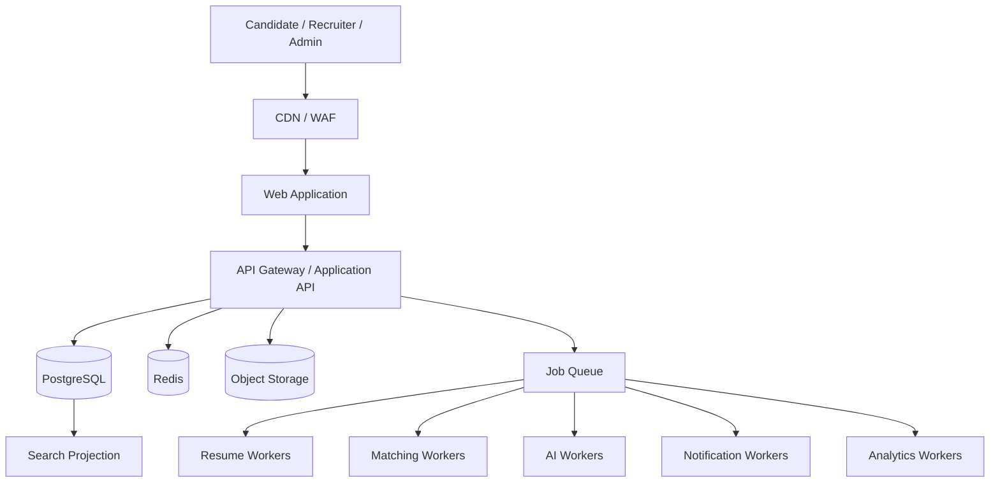

# Talent Network

> Documentation-first foundation for a scalable, reusable, AI-assisted hiring network and employment operating system.

## Status

**Phase:** Product & Architecture Definition  
**Implementation:** Not started  
**Repository role:** Single source of truth for product, design, engineering, architecture, infrastructure, security, AI, and deployment decisions.

---

## Product Thesis

Talent Network is not intended to be another generic job board.

It is being designed as a multi-sided employment platform combining:

- Talent marketplace
- Applicant Tracking System (ATS)
- Talent CRM
- Resume intelligence
- Explainable candidate-job matching
- Assessments and interview workflows
- Candidate career intelligence
- Trust, verification, and hiring analytics

The initial market focus is Pakistan, with architecture designed to evolve toward Gulf, remote international, and enterprise hiring use cases.

## Core Product Promise

**For candidates:** Apply where you genuinely have a strong chance.

**For employers:** Spend time reviewing relevant people instead of manually screening hundreds of resumes.

**For the platform:** Convert fragmented and unstructured employment data into reusable, explainable, structured hiring signal.

---

## Engineering North Star

Every implementation decision must optimize for:

1. **Scalability** — components should handle growth without unnecessary rewrites.
2. **Reusability** — shared domain capabilities must be reusable across products and surfaces.
3. **Maintainability** — clear boundaries, contracts, ownership, observability, and documentation.
4. **Modularity** — domains remain separable even when deployed together initially.
5. **Evolvability** — infrastructure complexity is introduced only when real scale justifies it.
6. **Security by design** — tenant isolation, authorization, auditability, and data privacy are foundational.
7. **Human-controlled AI** — AI assists, explains, summarizes, and prioritizes; humans retain consequential hiring decisions.
8. **Documentation as code** — architectural and product changes are incomplete until their documentation is updated.

See [`AGENTS.md`](./AGENTS.md) for mandatory contributor/agent rules.

---

## Target Architecture

We start with a **modular monolith plus independently scalable workers**, not premature microservices.



Interactive traffic and computational traffic are deliberately separated. Expensive operations such as resume parsing, malware scanning, matching, AI analysis, notifications, exports, and analytics run asynchronously.

---

## Product Domains

```text
Identity & Access
Organizations / Workspaces
Candidates / Career Passport
Resumes
Jobs
Applications
Hiring Pipelines
Talent CRM
Matching
Screening
Assessments
Interviews
Scorecards
Offers
Messaging
Notifications
Search
Automations
Analytics
Billing
Verification / Trust
Audit / Compliance
AI Platform
Administration
```

---

## Repository Roadmap

```text
.
├── README.md
├── AGENTS.md
├── CONTRIBUTING.md
├── docs/
│   ├── 00-vision/
│   ├── 01-research/
│   ├── 02-product/
│   ├── 03-architecture/
│   ├── 04-ai/
│   ├── 05-infrastructure/
│   ├── 06-security/
│   ├── 07-design/
│   ├── 08-api/
│   ├── 09-data/
│   ├── 10-decisions/
│   └── 11-implementation/
└── apps/                      # introduced when implementation begins
    ├── web/
    ├── api/
    ├── worker/
    └── scheduler/
```

Git does not preserve empty directories, so documentation folders are added as real documents are authored.

---

## Documentation Index

| Area | Entry point |
|---|---|
| Product blueprint | [`docs/02-product/master-blueprint.md`](./docs/02-product/master-blueprint.md) |
| Engineering principles | [`docs/03-architecture/engineering-principles.md`](./docs/03-architecture/engineering-principles.md) |
| Architecture decisions | [`docs/10-decisions/`](./docs/10-decisions/) |
| Agent/contributor rules | [`AGENTS.md`](./AGENTS.md) |

This index will grow with the repository.

---

## Initial Architecture Decisions

- Modular monolith first; service extraction only where load or ownership justifies it.
- PostgreSQL is the transactional source of truth.
- Redis is ephemeral infrastructure, not permanent business storage.
- Files belong in object storage, not relational database blobs.
- Heavy computation runs asynchronously.
- Candidate/job matching uses structured rules + evidence + semantic retrieval before expensive LLM reasoning.
- AI output is versioned, validated, auditable, and never treated as unquestionable truth.
- Multi-tenancy and authorization are backend-enforced from the beginning.
- High-volume recruiter interfaces use purpose-built read models, cursor pagination, virtualization, saved views, and split-pane workflows.

---

## Development Rule

> A feature is not complete when the code works. It is complete when the code, tests, observability, security implications, architecture documentation, API contracts, and user workflow documentation all agree.

---

## License

A license has not yet been selected. Until one is explicitly added, no open-source license is granted.