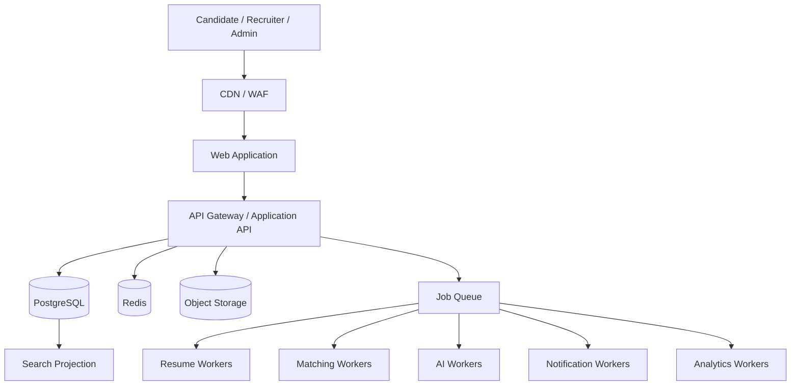

# Talent Network

> Documentation-first foundation for a scalable, reusable, AI-assisted hiring network and employment operating system.

## Status

**Phase:** Product & Architecture Definition  
**Implementation:** Not started  
**Repository role:** Single source of truth for product, design, engineering, architecture, infrastructure, security, AI, and deployment decisions.

---

## Product Thesis

Talent Network is not intended to be another generic job board.

It is being designed as a multi-sided employment platform combining:

- Talent marketplace
- Applicant Tracking System (ATS)
- Talent CRM
- Resume intelligence
- Explainable candidate-job matching
- Assessments and interview workflows
- Candidate career intelligence
- Trust, verification, and hiring analytics

The initial market focus is Pakistan, with architecture designed to evolve toward Gulf, remote international, and enterprise hiring use cases.

## Core Product Promise

**For candidates:** Apply where you genuinely have a strong chance.

**For employers:** Spend time reviewing relevant people instead of manually screening hundreds of resumes.

**For the platform:** Convert fragmented and unstructured employment data into reusable, explainable, structured hiring signal.

---

## Engineering North Star

Every implementation decision must optimize for:

1. **Scalability** — components should handle growth without unnecessary rewrites.
2. **Reusability** — shared domain capabilities must be reusable across products and surfaces.
3. **Maintainability** — clear boundaries, contracts, ownership, observability, and documentation.
4. **Modularity** — domains remain separable even when deployed together initially.
5. **Evolvability** — infrastructure complexity is introduced only when real scale justifies it.
6. **Security by design** — tenant isolation, authorization, auditability, and data privacy are foundational.
7. **Human-controlled AI** — AI assists, explains, summarizes, and prioritizes; humans retain consequential hiring decisions.
8. **Documentation as code** — architectural and product changes are incomplete until their documentation is updated.

See [`AGENTS.md`](./AGENTS.md) for mandatory contributor/agent rules.

---

## Target Architecture

We start with a **modular monolith plus independently scalable workers**, not premature microservices.



Interactive traffic and computational traffic are deliberately separated. Expensive operations such as resume parsing, malware scanning, matching, AI analysis, notifications, exports, and analytics run asynchronously.

---

## Product Domains

```text
Identity & Access
Organizations / Workspaces
Candidates / Career Passport
Resumes
Jobs
Applications
Hiring Pipelines
Talent CRM
Matching
Screening
Assessments
Interviews
Scorecards
Offers
Messaging
Notifications
Search
Automations
Analytics
Billing
Verification / Trust
Audit / Compliance
AI Platform
Administration
```

---

## Repository Roadmap

```text
.
├── README.md
├── AGENTS.md
├── CONTRIBUTING.md
├── docs/
│   ├── 00-vision/
│   ├── 01-research/
│   ├── 02-product/
│   ├── 03-architecture/
│   ├── 04-ai/
│   ├── 05-infrastructure/
│   ├── 06-security/
│   ├── 07-design/
│   ├── 08-api/
│   ├── 09-data/
│   ├── 10-decisions/
│   └── 11-implementation/
└── apps/                      # introduced when implementation begins
    ├── web/
    ├── api/
    ├── worker/
    └── scheduler/
```

Git does not preserve empty directories, so documentation folders are added as real documents are authored.

---

## Documentation Index

### Product

- [`docs/02-product/master-blueprint.md`](./docs/02-product/master-blueprint.md) — master product scope, workflows, product surfaces, AI/UX direction, MVP evolution

### Architecture

- [`docs/03-architecture/engineering-principles.md`](./docs/03-architecture/engineering-principles.md) — mandatory architecture quality principles
- [`docs/03-architecture/system-overview.md`](./docs/03-architecture/system-overview.md) — runtime topology, scaling stages, caching, workers, failure isolation
- [`docs/03-architecture/domain-architecture.md`](./docs/03-architecture/domain-architecture.md) — bounded domains, ownership, contracts, extraction readiness
- [`docs/03-architecture/data-architecture.md`](./docs/03-architecture/data-architecture.md) — transactional truth, versioning, projections, storage and migration strategy
- [`docs/03-architecture/event-architecture.md`](./docs/03-architecture/event-architecture.md) — outbox, queues, events, idempotency, retries and backpressure
- [`docs/03-architecture/multi-tenancy-and-authorization.md`](./docs/03-architecture/multi-tenancy-and-authorization.md) — tenant isolation, permissions, candidate privacy and entitlement boundaries

### API

- [`docs/08-api/api-architecture.md`](./docs/08-api/api-architecture.md) — REST/versioning conventions, read models, cursor pagination, error contracts, idempotency, rate limits and async operations

### AI & Intelligent Processing

- [`docs/04-ai/resume-processing-architecture.md`](./docs/04-ai/resume-processing-architecture.md) — secure upload, scan/extract/OCR/parse pipeline, review flow, retries, evidence and versioning
- [`docs/04-ai/matching-screening-architecture.md`](./docs/04-ai/matching-screening-architecture.md) — staged deterministic/semantic/evidence matching, screening, explainability and human decision ownership
- [`docs/04-ai/ai-gateway-and-cost-controls.md`](./docs/04-ai/ai-gateway-and-cost-controls.md) — provider-neutral AI gateway, structured output, cost budgets, privacy, routing and graceful degradation

### Infrastructure

- [`docs/05-infrastructure/load-capacity-model.md`](./docs/05-infrastructure/load-capacity-model.md) — traffic tiers, burst scenarios, API/database/queue/search scaling gates and load-test strategy
- [`docs/05-infrastructure/deployment-observability.md`](./docs/05-infrastructure/deployment-observability.md) — deployable units, environments, migration safety, telemetry, SLO evolution, alerts, runbooks and recovery

### Security

- [`docs/06-security/threat-model.md`](./docs/06-security/threat-model.md) — tenant, privacy, upload, AI, scraping, fraud, webhook, queue and incident threat controls

### Data

- [`docs/09-data/erd-and-entity-contracts.md`](./docs/09-data/erd-and-entity-contracts.md) — logical ERD, entity ownership, versioning, applications, matching, assessments, audit/outbox and indexing baseline

### Decisions

- [`docs/10-decisions/ADR-0001-modular-monolith-first.md`](./docs/10-decisions/ADR-0001-modular-monolith-first.md) — accepted initial deployment architecture

### Contribution Rules

- [`AGENTS.md`](./AGENTS.md) — mandatory rules for humans and coding agents
- [`CONTRIBUTING.md`](./CONTRIBUTING.md) — contribution process and quality expectations

This index must grow as the repository evolves.

---

## Initial Architecture Decisions

- Modular monolith first; service extraction only where load or ownership justifies it.
- PostgreSQL is the transactional source of truth.
- Redis is ephemeral infrastructure, not permanent business storage.
- Files belong in object storage, not relational database blobs.
- Heavy computation runs asynchronously.
- Reliable domain-event publication uses a transactional outbox pattern.
- Retryable consumers/jobs are idempotent and assume at-least-once delivery.
- Public/product APIs are versioned, contract-driven, tenant-safe, rate-limited, observable and use cursor pagination for large mutable datasets.
- Resume ingestion is a secure asynchronous pipeline; AI parsing creates a review proposal, never silent authoritative profile mutation.
- Candidate/job matching uses hard constraints + structured features + semantic retrieval + evidence before expensive LLM reasoning.
- Match results are versioned, explainable and preserve strengths, uncertainties and conflicts rather than only a score.
- AI access is centralized behind a provider-neutral gateway with schema validation, prompt/model versioning, privacy controls, cost tracking and graceful degradation.
- Security uses deny-by-default authorization, server-enforced tenant isolation, private file access, auditable privileged actions and explicit candidate privacy controls.
- Scale is handled by query/index/read-model optimization, horizontal stateless scaling and queue backpressure before distributed infrastructure is introduced.
- Production deploys use reversible migrations, bounded worker concurrency, structured telemetry, feature/AI kill switches, backups and recovery procedures.
- Important hiring inputs are versioned so historical application and matching outcomes remain explainable.
- Search, caches, analytics, embeddings and read projections are rebuildable derivatives rather than authoritative business state.
- High-volume recruiter interfaces use purpose-built read models, cursor pagination, virtualization, saved views, and split-pane workflows.

---

## Current Architecture Phase

Completed foundation documents:

```text
Product Blueprint
Engineering Principles
System Overview
Domain Architecture
Data Architecture
Event / Async Architecture
Multi-tenancy & Authorization
API Architecture & Error Contracts
Resume Processing Architecture
Matching & Screening Architecture
AI Gateway & Cost Controls
Security Threat Model
Load / Capacity Model
Deployment & Observability Architecture
Database ERD & Entity Contracts
ADR-0001 Modular Monolith First
```

Next planned specifications:

```text
Design System & UX Principles
Information Architecture & Route Map
Employer Workspace UX Specification
Candidate Experience UX Specification
Admin / Trust & Safety UX Specification
MVP Implementation Plan
Repository / Monorepo Bootstrap
```

Production implementation should begin only after the MVP architecture and core UX workflows are coherent enough to prevent avoidable rewrites.

---

## Development Rule

> A feature is not complete when the code works. It is complete when the code, tests, observability, security implications, architecture documentation, API contracts, and user workflow documentation all agree.

---

## License

A license has not yet been selected. Until one is explicitly added, no open-source license is granted.