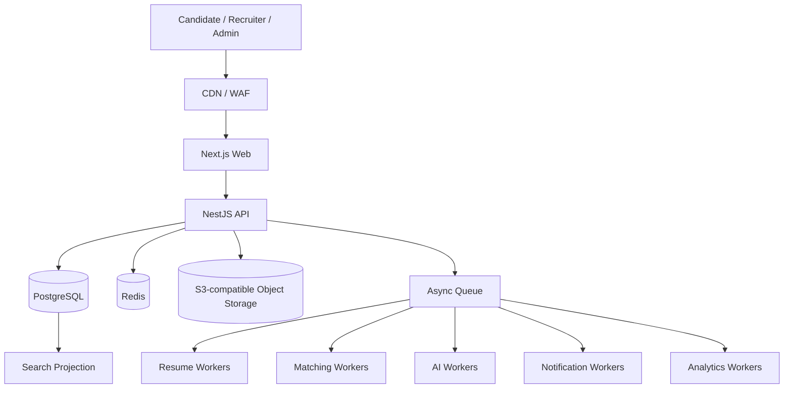

# Talent Network

> **An intelligent hiring network connecting companies with verified, relevant talent.**

Talent Network is a documentation-led, production-oriented employment operating system designed around structured hiring signal, explainable matching, reusable candidate data, and high-quality recruiter workflows.

## Project Status

| Area                                   | Status               |
| -------------------------------------- | -------------------- |
| Product blueprint                      | ✅ Complete          |
| Architecture baseline                  | ✅ Complete          |
| Security / scale / data specifications | ✅ Complete          |
| UX / information architecture          | ✅ Complete          |
| Monorepo bootstrap                     | ✅ Complete          |
| Engineering foundation                 | ✅ Complete          |
| Phase 1 backend foundation             | ✅ Verified          |
| Phase 1 authenticated web experience   | ✅ Verified          |
| Career Passport initial foundation     | ✅ Verified          |
| Identity / workspace context hardening | ✅ Phase 2A closed   |
| Career Passport expansion              | ✅ Phase 2B verified |
| Resume Intelligence                    | 🟡 Phase 3 current   |

**Current implementation phase:** Phase 3 — Resume Intelligence.

Phase 1 is closed after repository quality-gate verification plus browser-tested signup/login, organization onboarding, email verification, password recovery, invitation acceptance/revocation, multi-workspace switching, and permission-aware owner/recruiter behavior.

The initial Career Passport foundation is verified with database-backed integration coverage for initialization, versioned professional-profile updates, section preservation, experience/education versioning, and privacy state remaining separate from profile versions.

Phase 2A Identity & Workspace Context Hardening is closed after explicit Career activation, account-context discovery, reusable Career/Organization switching, last-active context restoration, stale-workspace fallback, mixed-context browser verification, and Candidate/Organization privacy-firewall regression coverage. A single human may safely hold a private Career identity and memberships in one or more hiring organizations without turning UI context into an authorization boundary.

Phase 2B Candidate Career Passport Expansion is **CLOSED / VERIFIED** after the complete local quality gate and final browser acceptance pass. It includes canonical and custom Passport sections, ordered edit/remove/reorder behavior, immutable-style professional versions, candidate-owned version history, derived evidence indicators, the reusable Candidate Workspace shell, preserved Organization/Career context switching, and responsive navigation while maintaining the Phase 2A privacy firewall.

Phase 3 now begins Resume Intelligence: secure resume upload, object storage, malware scanning, text extraction with OCR fallback, structured parsing, provenance/confidence handling, and candidate-reviewed proposed Career Passport changes. Resume parsing must never silently mutate the Career Passport.

The repository is the single source of truth for product, design, engineering, architecture, infrastructure, security, AI, UX, and deployment decisions.

---

## Product Thesis

Talent Network is not intended to be another generic job board. It is designed as a multi-sided employment platform combining:

- Talent marketplace
- Applicant Tracking System (ATS)
- Talent CRM
- Resume intelligence
- Explainable candidate-job matching
- Assessments and interview workflows
- Candidate career intelligence
- Trust, verification, and hiring analytics

Initial market focus is Pakistan, while the architecture remains capable of evolving toward Gulf, international remote, and enterprise hiring use cases.

### Product promises

**Candidate:** Apply where you genuinely have a strong chance.  
**Employer:** Review relevant people instead of manually screening hundreds of resumes.  
**Platform:** Convert fragmented employment data into reusable, explainable, structured hiring signal.

### Privacy promise

Career and Hiring are separate data-ownership contexts even when the same person uses both.

> **Your Career identity is personal. Joining a company workspace does not give that company access to your private Career Passport.**

Future application flows cross that boundary only through explicit candidate submission/consent and organization-owned application snapshots. See [`docs/06-security/candidate-organization-privacy-firewall.md`](./docs/06-security/candidate-organization-privacy-firewall.md).

---

## Identity Model

Talent Network does **not** permanently classify a user as either a candidate or an employer.

A `User` is the authenticated human identity. Candidate and organization participation are independent contexts that can coexist:

```text
User
├── Candidate?                 personal career context
└── OrganizationMember[]      zero or more hiring contexts
    └── Organization
```

A founder can maintain a private Career Passport while owning an organization. A recruiter can belong to several organizations. A candidate can accept a recruiter invitation without creating a second account.

Onboarding therefore asks what the person wants to do now:

```text
Build my career
Hire talent
```

The choice is not permanent, and the other context can be added later.

Active UI context is navigation state only. Server-side candidate ownership, organization membership, tenant scope, and permission evaluation remain authoritative for every protected operation.

See:

- [`docs/10-decisions/ADR-0002-user-context-not-account-type.md`](./docs/10-decisions/ADR-0002-user-context-not-account-type.md)
- [`docs/03-architecture/identity-and-workspace-context.md`](./docs/03-architecture/identity-and-workspace-context.md)
- [`docs/07-design/onboarding-and-context-switching.md`](./docs/07-design/onboarding-and-context-switching.md)

---

## Engineering North Star

Every implementation decision must preserve or improve:

1. **Scalability** — scale without unnecessary rewrites.
2. **Reusability** — shared domain capabilities are composed, not copied.
3. **Maintainability** — explicit boundaries, contracts, ownership, and documentation.
4. **Modularity** — domains remain separable even while initially deployed together.
5. **Evolvability** — complexity is introduced only when measured need justifies it.
6. **Security by design** — tenant isolation, authorization, auditability, and privacy are foundational.
7. **Human-controlled AI** — AI assists and explains; people retain consequential hiring decisions.
8. **Documentation as code** — architectural changes are incomplete until documentation agrees.

See [`AGENTS.md`](./AGENTS.md) for mandatory contributor and coding-agent rules.

---

## Runtime Architecture

We begin with a **modular monolith plus independently scalable workers** rather than premature microservices.



Interactive traffic and heavy computational traffic are intentionally separated. Resume processing, malware scanning, matching, AI inference, notifications, exports, and analytics should not block normal HTTP requests.

---

## Monorepo

```text
apps/
├── web/            Next.js product application
├── api/            NestJS API
├── worker/         asynchronous/background processing
└── scheduler/      recurring and maintenance workflows

packages/
├── config/         runtime-specific validated configuration
├── contracts/      shared transport/API contracts
├── database/       Prisma/PostgreSQL ownership
└── observability/  structured logging foundation
```

Additional domain packages are created only when implementation genuinely needs them. Empty future-domain packages are intentionally avoided.

### Current infrastructure

```text
PostgreSQL  → transactional source of truth
Redis       → cache, coordination and queue infrastructure
RustFS      → local S3-compatible object storage
Prisma      → migrations and database client
pnpm        → workspace/package management
Turborepo   → repository task orchestration
```

RustFS is a **local infrastructure choice**, not an application dependency. Application code must use the generic S3-compatible storage contract so production storage can later move to RustFS, AWS S3, Cloudflare R2, or another validated S3-compatible provider without rewriting business logic.

See [`docs/05-infrastructure/object-storage.md`](./docs/05-infrastructure/object-storage.md).

---

## Local Development

### Requirements

- Node.js 24.x
- pnpm 11.x
- Docker with Docker Compose

The repository currently standardizes on pnpm `11.18.0` through the root `packageManager` field while accepting compatible pnpm 11 releases via the engine range.

### Bootstrap

```bash
cp .env.example .env
docker compose up -d
pnpm install
pnpm dev
```

Local services:

```text
Web               http://localhost:3000
API               http://localhost:4000
PostgreSQL        localhost:5432
Redis             localhost:6379
RustFS S3 API     http://localhost:9000
RustFS Console    http://localhost:9001
```

The local RustFS container uses the same generic `S3_*` credentials consumed by the application. The Compose stack initializes its named data volume permissions before RustFS starts because RustFS runs as a non-root user.

The intended development bucket is:

```text
talent-network-local
```

Bucket provisioning will be automated alongside the storage adapter/resume-upload implementation. Production bucket creation belongs to infrastructure provisioning rather than normal API startup.

### API health contract

```text
GET /api/v1/health/live
GET /api/v1/health/ready
```

`live` proves that the process is alive. `ready` verifies dependencies required to serve traffic, currently PostgreSQL and Redis.
