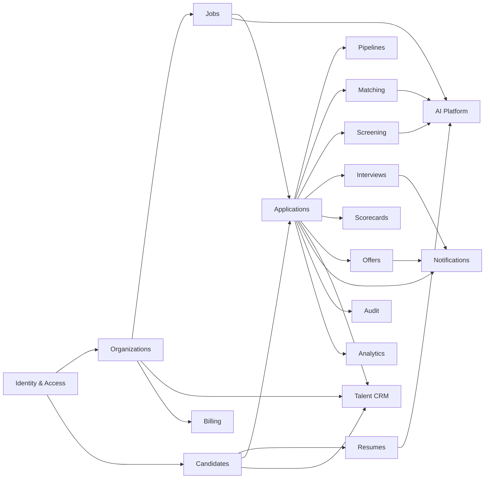

# Domain Architecture

**Status:** Draft v0.1

## Purpose

Talent Network is intentionally broad, so the codebase must be organized around business capabilities rather than technical layers. This document defines the initial bounded domains, their ownership, and the rules for communication between them.

## Domain map

## Boundary rule

A domain owns its business invariants and persistence behavior. Other domains must not bypass that ownership by directly mutating its tables or importing internal repository classes.

Inside the modular monolith, communication may initially be in-process, but it must still flow through explicit application contracts so later service extraction is possible.

## Initial bounded domains

### Identity & Access

Owns:

- users
- authentication identities
- sessions
- password/authentication lifecycle
- MFA-ready primitives
- global identity state

Does not own employer organization membership or candidate career data.

### Organizations

Owns:

- organizations/workspaces
- organization members
- teams
- role/permission assignment
- organization settings
- company verification state references

Key invariant: organization-owned actions must resolve and authorize tenant context server-side.

### Candidates

Owns:

- candidate core profile
- Career Passport
- profile versions
- employment history
- education
- skills
- projects
- certifications
- preferences
- availability
- candidate privacy/discoverability settings

Key invariant: authoritative profile mutations are user-approved or explicitly system-authorized; imported AI interpretations do not silently become truth.

### Resumes

Owns:

- resume records
- resume versions
- file metadata
- processing status
- extracted/normalized proposal data
- parse confidence
- resume review state

Does not own the authoritative candidate profile.

### Jobs

Owns:

- job definitions
- structured requirements/preferences
- compensation metadata
- location/work-mode policy
- publication lifecycle
- job versions
- screening question definitions
- pipeline assignment

Key invariant: hiring criteria relevant to matching must be represented structurally, not only as prose.

### Applications

Owns:

- candidate-to-job application
- submission timestamp/state
- submitted profile/resume version references
- screening answers at submission
- application lifecycle
- canonical current stage reference
- application activity timeline coordination

Key invariant: one logical application cannot be duplicated through retries or repeated clicks where product policy says uniqueness applies.

### Pipelines

Owns:

- pipeline templates
- stages
- stage ordering
- allowed transitions/policies where configured
- stage history semantics

Stages are entities, not hard-coded global enum values.

### Matching

Owns:

- job-candidate match computations
- score components
- confidence
- strengths/gaps/uncertainties/conflicts
- matching model/version metadata
- recomputation policy

Matching consumes candidate/job/evidence snapshots but does not own them.

### Screening

Owns:

- screening criteria execution
- required/preferred/informational rule results
- screening summaries
- review flags
- explainable prioritization outputs

It must not autonomously make final employment decisions.

### Talent CRM

Owns employer-side reusable talent relationships beyond a single application:

- talent records/references
- talent pools
- sourced candidates
- previous applicants/finalists
- employer-specific tags/status
- relationship/activity metadata

Candidate privacy boundaries remain authoritative from the Candidate/Privacy capabilities.

### Assessments

Owns:

- assessment definitions
- versions
- invites
- attempts
- results
- assessment evidence

Results used in matching must reference the exact assessment/version.

### Interviews

Owns:

- interview plans
- sessions
- participants
- scheduling state
- calendar integration references
- interview status

### Scorecards

Owns:

- scorecard templates
- criteria
- submitted interviewer evaluations
- completion state

Scorecards should support structured evaluation and preserve historical submissions.

### Offers

Owns:

- offer drafts
- approvals
- offer versions
- sent/accepted/declined state
- related compensation snapshot

Offer state changes are auditable and idempotent.

### Messaging

Owns internal/application-linked communication threads when introduced. External transport adapters remain separate.

### Notifications

Owns:

- notification intents
- preferences
- channel routing
- delivery state
- retries
- provider message references

Business domains request notifications; they do not call email/SMS providers directly.

### Search

Owns rebuildable search projections and query orchestration. It never becomes transactional truth.

### Automations

Owns:

- automation definitions
- triggers
- conditions
- actions
- execution records

Automations consume domain events and invoke explicit commands rather than mutating arbitrary tables.

### Analytics

Owns:

- product/business event consumption
- aggregates
- reporting projections

It must never block transactional hiring workflows.

### Billing

Owns:

- plans
- subscriptions
- entitlements
- invoices/payment-provider references
- usage counters where commercially relevant

Product modules query entitlements through Billing contracts rather than scattering plan-name checks.

### Verification & Trust

Owns:

- employer verification cases
- candidate/skill verification evidence
- trust signals
- moderation/review cases
- risk flags

Flags must be represented as review signals rather than unreviewable accusations.

### Audit

Owns immutable/append-oriented audit records for consequential system actions.

### AI Platform

Owns shared model-provider infrastructure:

- provider adapters
- routing
- prompt/model versions
- schema validation
- retries/timeouts
- usage/cost telemetry
- safety/privacy controls

It does not own hiring business decisions. Domain modules own the meaning of AI outputs.

## Cross-domain communication

### Synchronous commands/queries

Use when the caller needs an immediate authoritative result within the same user operation.

Examples:

- Applications asks Jobs for a publishable job snapshot.
- Authorization asks Organizations for membership/permission context.
- Applications asks Candidates for the profile version selected for submission.

### Domain events

Use for facts that happened and may have multiple independent consumers.

Examples:

- `APPLICATION_CREATED`
- `RESUME_REVIEW_APPROVED`
- `JOB_PUBLISHED`
- `INTERVIEW_SCHEDULED`
- `OFFER_ACCEPTED`

Consumers must be idempotent.

## Dependency rules

1. UI/app entrypoints may call domain application services.
2. Domain modules may depend on shared technical primitives through explicit interfaces.
3. A domain must not import another domain's persistence implementation.
4. Cross-domain writes go through the owning domain's application contract.
5. Events carry stable identifiers and minimum required facts, not uncontrolled entity dumps.
6. Provider SDKs remain behind infrastructure adapters.
7. Shared packages cannot become a bypass around domain ownership.

## Shared kernel

Keep small and stable.

Potential reusable primitives:

- IDs/value-object helpers
- time/clock interface
- pagination contracts
- result/error primitives
- event envelope
- money/currency primitives
- country/location primitives
- audit actor context
- tenant/request context

Do not place mutable business rules in a generic `shared` package.

## Data ownership examples

| Question | Owning domain |
|---|---|
| Is this recruiter allowed to view this organization's candidates? | Organizations / Authorization |
| What did this candidate profile contain when they applied? | Candidates + Application snapshot reference |
| What is the current pipeline stage? | Applications/Pipelines contract |
| Why is the candidate ranked 91? | Matching |
| Was the resume parse accepted by the candidate? | Resumes |
| Has an interview email been delivered? | Notifications |
| What plan features can this company use? | Billing/Entitlements |
| Who changed this offer? | Audit |

## Extraction readiness

A domain is extraction-ready when:

- it owns its persistence semantics
- callers use application contracts
- asynchronous facts are represented as events
- direct cross-domain table writes do not exist
- observability identifies domain workload
- its failure behavior is understood

This does not mean it should be extracted; it means extraction can happen without a rewrite if later justified.

## Anti-patterns

Avoid:

- a global `services/` folder containing unrelated business logic
- direct Prisma access from controllers across many domains
- shared DTOs that accidentally couple every module
- one giant Candidate object loaded for every screen
- business decisions buried in queue processors
- AI provider calls directly from controllers
- organization ID filtering performed only in frontend code
- hard-coded hiring pipelines

## Domain architecture invariant

> The modular monolith is allowed to share a process and database; it is not allowed to share unclear ownership.