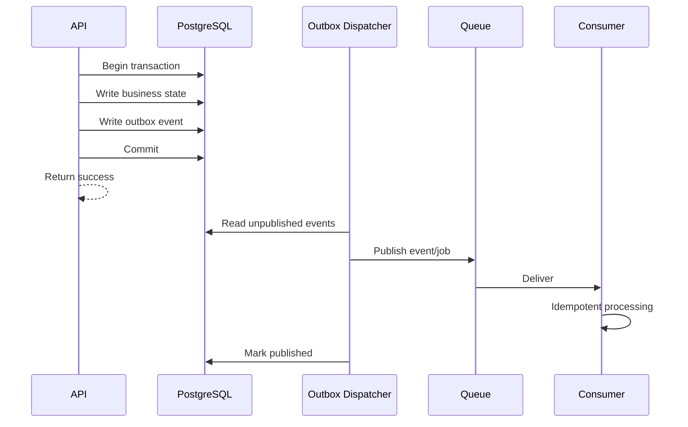

# Event & Asynchronous Work Architecture

**Status:** Draft v0.1

## Purpose

Talent Network relies on asynchronous processing for burst absorption, reliability, and independent scaling. This document defines the difference between domain events and jobs, the delivery guarantees we target, and the outbox/idempotency rules that keep the system correct.

## Core principles

1. A committed business fact must not be lost because queue publication failed.
2. Consumers must tolerate duplicate delivery.
3. Heavy work must not block interactive API requests.
4. Events describe facts; jobs request work.
5. Event payloads are versioned contracts, not ORM entity dumps.
6. Queue infrastructure is transport, not source of truth.

## Events vs jobs

### Domain event

A fact that already happened.

Examples:

- `APPLICATION_CREATED`
- `JOB_PUBLISHED`
- `RESUME_REVIEW_APPROVED`
- `INTERVIEW_SCHEDULED`
- `OFFER_ACCEPTED`

Many consumers may react independently.

### Job / command

A request to perform specific work.

Examples:

- `resume.extract`
- `resume.parse`
- `matching.compute`
- `notification.email.send`
- `search.candidate.index`
- `export.candidates.generate`

Jobs generally have one logical work owner.

## Reliable publication

Use the transactional outbox pattern for business events that must follow a committed write.



The exact dispatcher mechanism may evolve, but business state and outbox intent must commit atomically.

## Event envelope

Conceptual contract:

```json
{
  "eventId": "opaque-id",
  "eventType": "APPLICATION_CREATED",
  "eventVersion": 1,
  "occurredAt": "2026-09-14T12:00:00Z",
  "aggregateType": "APPLICATION",
  "aggregateId": "...",
  "organizationId": "...",
  "correlationId": "...",
  "causationId": "...",
  "payload": {}
}
```

`organizationId` is included only where applicable.

## Payload rules

Payloads should contain enough immutable facts for consumers to decide what to do, but avoid copying full aggregates or sensitive data unnecessarily.

Prefer IDs + stable facts over large nested entities.

Bad:

```json
{
  "eventType": "APPLICATION_CREATED",
  "candidate": { "entireCandidateObject": "..." },
  "job": { "entireJobObject": "..." }
}
```

Better:

```json
{
  "eventType": "APPLICATION_CREATED",
  "applicationId": "...",
  "candidateId": "...",
  "jobId": "...",
  "jobVersionId": "...",
  "organizationId": "..."
}
```

Consumers can load authoritative data through controlled contracts if needed.

## Versioning

Event contracts are versioned independently from source code.

Rules:

- additive backward-compatible fields may remain in the same version
- breaking semantic/shape changes require a new event version
- consumers should declare supported versions
- never silently repurpose a field with different meaning

## Delivery semantics

Assume **at-least-once delivery**.

Exactly-once processing should not be assumed from the transport.

Correctness comes from idempotent consumers and database constraints.

## Idempotency

Each consumer must define its logical idempotency key.

Examples:

```text
resume.parse:
  resumeVersionId + parserVersion

matching.compute:
  candidateProfileVersionId + jobVersionId + matchingModelVersion

notification.email.send:
  notificationIntentId + channel

search.index:
  entityType + entityId + sourceVersion
```

Possible enforcement tools:

- unique database constraints
- processed-message records
- deterministic derived-record identity
- compare-and-set status transitions
- idempotency table/cache backed by authoritative constraints

Redis alone must not be the only idempotency guarantee for important business effects.

## Queue families

Initial logical queues:

```text
resume.scan
resume.extract
resume.parse
resume.embed

matching.compute
screening.evaluate

ai.summary
ai.job-structure
ai.interview-kit

notification.email
notification.inapp

search.index.candidate
search.index.job

analytics.consume
analytics.aggregate

export.generate

maintenance.retention
maintenance.reconcile
```

These names are conceptual; implementation can group them while preserving independent concurrency controls.

## Retry policy

Retries depend on failure type.

### Retryable

- provider timeout
- temporary database connectivity issue
- rate limit
- transient storage failure
- email provider outage

### Usually not retryable without data change

- invalid file format
- schema validation failure
- unsupported document
- missing required authoritative record
- permanently revoked access

Use exponential backoff with jitter for transient external failures.

## Dead-letter / terminal failure

Jobs that exhaust retries must become visible operational state, not disappear.

Required metadata:

- job/event identity
- queue
- tenant where safe
- attempts
- first/last failure time
- normalized error classification
- correlation ID
- replay eligibility

Operations should support safe replay after root cause resolution.

## Backpressure

Concurrency is explicitly bounded.

Example:

```text
resume.extract:        50 concurrent
matching.compute:     100 concurrent
ai.summary:            10 concurrent
notification.email:    40 concurrent
export.generate:        3 concurrent
```

Numbers are configuration examples, not fixed values.

Concurrency will be tuned from observed provider limits, CPU/memory, queue age, cost, and latency goals.

## Priority

Not all queued work has equal urgency.

Potential classes:

1. interactive follow-up (high)
2. hiring workflow (normal)
3. indexing/analytics (lower)
4. bulk exports/reprocessing (background)

Background recomputation must not starve candidate or recruiter-facing workflows.

## Tenant fairness

A single enterprise import or viral job should not consume all shared processing capacity.

At scale, apply one or more of:

- per-tenant concurrency limits
- weighted queues
- fair scheduling
- rate-limited job creation
- isolated premium/enterprise worker pools where commercially justified

## Observability

Per queue/worker family measure:

- queue depth
- oldest job age
- enqueue rate
- processing rate
- success/error rate
- retries
- terminal failures
- p50/p95/p99 job duration
- provider latency
- CPU/memory where relevant
- tenant/workload contribution where safe
- cost for AI/provider-backed jobs

## Correlation

Propagate request/correlation IDs through:

```text
HTTP request
-> database transaction
-> outbox event
-> queue job
-> provider call
-> resulting event
```

This makes cross-stage failures debuggable.

## Event-driven automation

The Automation domain subscribes to domain events.

Example:

```text
APPLICATION_STAGE_CHANGED
  -> automation rules matching new stage
  -> schedule explicit actions
  -> notification / assessment command
```

Automation engines must never directly mutate unrelated domain tables.

## Event retention

Operational outbox/queue retention and long-term business analytics retention are separate concerns.

Do not keep infinite queue history merely for analytics. Business events needed for reporting should flow into an appropriate analytics/event store with its own retention policy.

## Migration path

Initial transport may use BullMQ/Redis.

If throughput, fan-out, retention, replay, or multi-service ownership later require an event-streaming platform, event contracts and the outbox model allow transport replacement without rewriting business semantics.

Potential future transport is explicitly undecided.

## Invariant

> A queue may delay work, retry work, or be replaced entirely; it must never be the only place where an important business fact exists.