# Multi-Tenancy & Authorization Architecture

**Status:** Draft v0.1

## Purpose

Talent Network is a multi-tenant hiring platform. Employer data isolation, candidate privacy, and permission checks must be foundational rather than retrofit concerns.

This document defines the initial tenant model and authorization approach.

## Tenant model

The primary employer tenant is an `Organization`.

```text
Organization
├── Members
├── Teams
├── Jobs
├── Pipelines
├── Talent Pools
├── Interviews
├── Automations
├── Analytics
├── Billing
└── Settings
```

A user may belong to multiple organizations.

Candidate identity/profile data is not owned by an employer organization. Employers receive scoped access to candidate information through applications, candidate visibility rules, sourcing/talent relationships, and platform policy.

## Core authorization principles

1. Authentication answers **who is the actor?**
2. Tenant resolution answers **which organization context is active?**
3. Authorization answers **may this actor perform this action on this resource?**
4. Privacy policy answers **which candidate data may be exposed?**
5. Entitlements answer **is this feature available to this account/plan?**

These concerns must remain distinct.

## Organization membership

Conceptual model:

```text
OrganizationMember
├── organizationId
├── userId
├── status
├── roleAssignments[]
├── teamAssignments[]
└── createdAt
```

Membership must be active before organization permissions are evaluated.

## Roles vs permissions

Roles are convenience bundles. Permissions are the stable enforcement language.

Initial role examples:

- OWNER
- ADMIN
- RECRUITER
- HIRING_MANAGER
- INTERVIEWER
- VIEWER

Example permissions:

```text
organization:view
organization:manage
members:view
members:invite
members:manage

jobs:view
jobs:create
jobs:update
jobs:publish
jobs:close

candidates:view
candidates:export
candidates:contact

applications:view
applications:move_stage
applications:reject
applications:comment

interviews:view
interviews:schedule
interviews:evaluate

offers:view
offers:create
offers:approve
offers:send

analytics:view
billing:view
billing:manage
settings:manage
```

The exact permission catalog will evolve, but route/service checks should depend on permissions rather than scattered role-name conditionals.

## Permission evaluation

Conceptual flow:

```mermaid
flowchart LR
    R[Request] --> AUTH[Authenticate]
    AUTH --> TENANT[Resolve Organization Context]
    TENANT --> MEMBER[Load Active Membership]
    MEMBER --> PERM[Resolve Effective Permissions]
    PERM --> RESOURCE[Validate Resource Ownership / Scope]
    RESOURCE --> PRIVACY[Apply Candidate Privacy Rules]
    PRIVACY --> ENT[Check Feature Entitlement if needed]
    ENT --> ALLOW[Execute]
```



A permission alone is not sufficient when resource ownership/scope is wrong.

Example: a recruiter with `jobs:update` in Organization A cannot update a job belonging to Organization B.

## Tenant context

The active `organizationId` must be resolved from authenticated membership and request context.

Never trust arbitrary client-supplied organization ownership claims.

If routes include organization identifiers, they are selectors—not proof of access.

## Persistence enforcement

Employer-owned records should generally include `organizationId` directly where it materially improves security and query efficiency.

Examples:

- Job
- Application
- Pipeline
- TalentPool
- Automation
- Interview where organization-scoped
- Offer
- AuditRecord where organization-scoped

Repository/service methods should require tenant context for organization-owned access.

Bad:

```text
applicationRepository.findById(applicationId)
```

Preferred conceptual API:

```text
applicationRepository.findByIdForOrganization(applicationId, organizationId)
```

or equivalent policy-enforced data access.

## Candidate data access

Candidate information requires an additional privacy/scope layer.

Potential access bases:

- candidate applied to the organization's job
- candidate intentionally joined an employer-accessible talent network
- candidate visibility is enabled for verified recruiters
- candidate was imported/sourced under valid platform rules and consent basis
- candidate has an existing employer relationship permitted by policy

The presence of a candidate ID is never sufficient authorization.

## Private Talent Mode

Future candidate privacy controls may include:

- not searchable
- searchable only by verified recruiters
- anonymous preview before candidate approval
- block specific organizations/current employer
- hide contact details until candidate accepts outreach

Search indexes must encode enough visibility metadata to prevent unauthorized discovery, and authoritative checks must still occur before returning sensitive detail.

## Data export

Candidate export is a high-risk capability.

Requirements:

- explicit permission (`candidates:export`)
- tenant-scoped dataset
- rate limits/quotas
- audit entry
- async generation for large exports
- expiration for generated download links
- privacy filtering
- optional watermark/export actor metadata later

## Object storage authorization

Do not expose permanent public resume URLs.

Access flow:

```text
Authorized user
  -> API permission + tenant/privacy check
  -> short-lived signed download URL
  -> object storage
```

Storage keys are identifiers, not authorization mechanisms.

## Background jobs and tenancy

Every tenant-specific job/event must carry enough tenant context to prevent cross-organization processing.

Workers must revalidate authoritative resource ownership where the action is consequential.

Never trust a queue payload merely because it originated internally.

## Cache keys

Tenant-scoped cache keys must include tenant identity where relevant.

Example:

```text
org:{organizationId}:job:{jobId}:applicant-view:{viewHash}
```

Avoid shared cache keys that can leak one tenant's data into another tenant response.

## Search isolation

Every employer talent-search query must apply privacy and tenant/access predicates.

The search engine is not a security boundary.

Sensitive records returned from search should be validated against authoritative access rules before detail exposure.

## Analytics isolation

Organization analytics queries must include tenant scope by construction.

Cross-tenant platform analytics belong to privileged platform-admin/internal services, not employer APIs.

## Admin access

Platform administration is distinct from organization administration.

Platform support/admin capabilities must have:

- separate explicit permissions
- strong authentication expectations
- audit logging
- least privilege
- elevated-action reason/context where appropriate

Do not implement a hidden universal bypass in normal organization permission code.

## Impersonation / support access

If support impersonation is ever introduced, it requires its own ADR/security specification.

Minimum future expectations:

- explicit privileged permission
- visible impersonation state
- short duration
- audit trail
- reason/ticket reference
- restrictions around highly sensitive actions

## Entitlements

Authorization and subscription entitlements are separate.

Example:

A recruiter may have permission to export candidates, but the organization's current plan may not include export.

Conceptual decision:

```text
allowed =
  authorized(actor, action, resource)
  AND entitled(organization, feature)
```

Do not hardcode plan names across product modules.

## Invitation security

Organization invitations must:

- use random single-purpose tokens
- expire
- be single-use or safely idempotent
- bind to intended organization and recipient policy
- validate current membership state before acceptance
- be auditable

## Session changes

Permission/membership changes should take effect promptly.

Do not embed long-lived immutable authorization claims in tokens that cannot be revoked efficiently.

Session/auth architecture should support server-side permission re-evaluation or short-lived claims plus revocation controls.

## Database-level protections

Application-layer authorization remains required.

PostgreSQL Row Level Security may be evaluated later as defense-in-depth, but will not replace explicit application authorization.

If RLS is introduced, it requires an ADR because it changes connection/session/data-access assumptions.

## Authorization testing

Every sensitive resource should include tests for:

- allowed role/permission
- denied permission
- wrong organization
- inactive membership
- missing resource
- candidate privacy restriction
- revoked access
- relevant entitlement failure

Cross-tenant tests are mandatory for employer-owned domains.

## Audit expectations

Examples of auditable actions:

- member invited/removed
- role/permission changed
- candidate resume viewed/downloaded where policy requires
- candidate exported
- stage/rejection decision changed
- offer created/approved/sent
- organization verification changed
- billing/admin settings changed

## Security invariant

> Every employer-owned read or write must prove tenant scope server-side, and every candidate-data read must additionally satisfy the candidate's permitted visibility/access basis.
