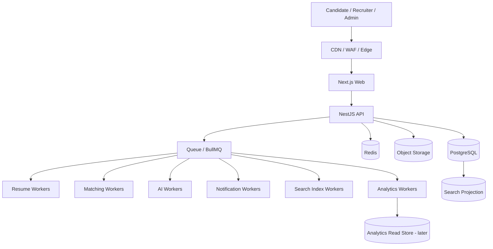
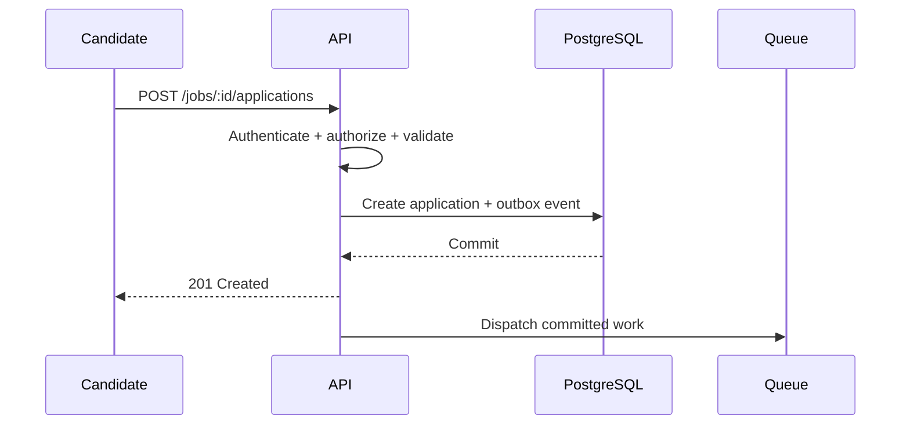

# System Architecture Overview

**Status:** Draft v0.1  
**Scope:** MVP foundation through growth-stage evolution

## Purpose

This document defines the high-level runtime architecture for Talent Network. It translates the product blueprint into deployable system boundaries while preserving the core rule: **design for scale and extraction, but do not pay for distributed-system complexity before it is justified.**

## Architectural style

Talent Network begins as a **modular monolith with independently scalable worker processes**.

Transactional business capabilities execute in the API application. Slow, bursty, expensive, or retryable workloads execute asynchronously through queues and workers.



## Initial deployable units

### `web`

Responsibilities:

- candidate experience
- employer/recruiter experience
- administration experience
- authenticated routing
- server/client rendering as appropriate
- frontend query caching
- accessibility and interaction behavior

The web application must not contain authoritative permission decisions. It may hide unavailable actions for UX, but the API enforces all permissions.

### `api`

Responsibilities:

- authentication and session validation
- tenant resolution
- authorization
- synchronous application use cases
- transactional writes
- transactional reads
- purpose-built read models
- upload authorization
- queue/event publication
- idempotency checks
- API rate limits

The API must remain stateless enough to scale horizontally. Session and coordination state belongs in shared infrastructure such as Redis/database-backed stores.

### `worker`

One codebase may initially host multiple queue processors, but concurrency must be independently configurable per workload.

Workload families:

- resume/file processing
- matching/screening
- AI inference
- search indexing
- notifications
- exports
- analytics aggregation

High-volume worker families may later become independent deployables without changing their domain contracts.

### `scheduler`

Responsibilities:

- periodic cleanup
- delayed automation evaluation
- stale-workflow reminders
- scheduled analytics aggregation
- retention tasks
- provider reconciliation

Schedulers should enqueue work rather than performing large workloads directly.

## Interactive request rule

User-facing requests must do the minimum necessary synchronous work.

Example application flow:



Resume analysis, AI summaries, matching, notification delivery, and analytics are not allowed to block the application response.

## Transaction and event consistency

Business writes and event intent must not diverge.

Initial recommended pattern:

1. Perform business mutation in PostgreSQL transaction.
2. Write an outbox/event record in the same transaction.
3. A dispatcher publishes pending events/jobs to the queue.
4. Consumers process idempotently.
5. Published/processed state is observable and retryable.

This avoids the failure mode where a database transaction commits but its required asynchronous work is silently lost.

## Source-of-truth boundaries

| Data type | Authoritative store |
|---|---|
| Users, organizations, candidates, jobs, applications | PostgreSQL |
| Pipeline state and stage history | PostgreSQL |
| Resume metadata and versions | PostgreSQL |
| Resume/file bytes | Object storage |
| Sessions, rate limits, locks, queue state | Redis / ephemeral systems |
| Search documents | Rebuildable search projection |
| Embeddings/vector representations | Rebuildable derived projection |
| Analytics aggregates | Rebuildable derived store |

Derived systems must never become the only copy of transactional business truth.

## Scaling model

### Stage A — Validation / early production

```text
Web:         1–2 instances / managed frontend
API:         1–2 stateless instances
Worker:      1+ instance, queue-specific concurrency
PostgreSQL:  managed single primary + backups
Redis:       managed instance
Storage:     S3-compatible object storage
Search:      PostgreSQL
Analytics:   PostgreSQL events/aggregates
```

### Stage B — Growth

Scale independently:

- API replicas
- resume worker concurrency
- matching worker concurrency
- AI worker concurrency
- notification workers

Potential additions:

- PostgreSQL read replica for read-heavy safe workloads
- dedicated search engine
- separate worker deployments by queue family
- dedicated analytics store

### Stage C — High scale / enterprise

Only after measured need:

- extracted high-load services
- event-streaming platform
- partitioning for specific large tables
- dedicated regional/tenant infrastructure where justified
- enterprise identity infrastructure
- warehouse/ClickHouse-class analytics

## Burst handling

The system must remain stable when a single popular job receives a large burst.

Example:

```text
20,000 application submissions
        |
        +--> API writes remain bounded
        +--> queue backlog absorbs expensive work
        +--> resume/matching/AI concurrency remains capped
        +--> progress is observable
        +--> no request fans out into synchronous third-party calls
```

Backpressure is a feature. It is better to process expensive work predictably over time than overload dependencies and fail globally.

## Concurrency isolation

Do not let one workload starve another.

Examples:

- `resume.parse` has separate concurrency from `notification.email`
- `matching.compute` has separate concurrency from `ai.interview-kit`
- exports cannot consume all worker capacity
- expensive model calls have provider- and tenant-aware limits

## API read strategy

Complex screens receive purpose-built projections.

Bad pattern:

```text
Applicant table
  -> fetch applications
  -> fetch candidate for each row
  -> fetch score for each row
  -> fetch assessment for each row
  -> fetch stage for each row
```

Preferred pattern:

```text
GET /v1/jobs/:jobId/applicants?cursor=...&limit=50
```

The response includes the exact list-row summary. Deeper detail loads only when a candidate is opened.

## Pagination and large collections

Use cursor pagination for:

- applications
- jobs
- talent search
- activity timelines
- audit history

Offset pagination may be acceptable only for small/stable administrative collections.

## Cache strategy

### Browser/query cache

Use for server-state deduplication, prefetching, and safe optimistic updates.

### CDN/edge cache

Candidate targets:

- public job pages
- public company pages
- static assets
- marketing content

### Redis

Use for:

- sessions
- rate limits
- short-lived query results where justified
- distributed locks
- idempotency coordination
- counters
- queue state

Cache correctness must not be required for transactional correctness.

## Failure isolation

Expected failure behavior:

- AI provider failure does not prevent an application submission.
- Email provider failure retries independently.
- Search indexing delay does not corrupt PostgreSQL truth.
- Analytics outage does not block hiring workflows.
- Resume parsing failure leaves a recoverable processing state.
- Worker crashes result in retry/dead-letter handling, not silent loss.

## Observability requirements

All deployables must expose enough telemetry to answer:

- Is it healthy?
- Is it slow?
- Is it overloaded?
- Is a dependency failing?
- Which tenant/workload is driving load?
- Is queue backlog increasing?
- What does the operation cost?

Minimum dimensions:

- request rate
- p50/p95/p99 latency
- error rate
- DB query latency
- connection-pool utilization
- queue depth
- queue oldest-job age
- worker duration
- retry/dead-letter counts
- external-provider latency/error
- AI token/cost usage

## Service extraction criteria

A module becomes an independent service only when evidence shows a meaningful benefit in one or more of:

- independent scaling
- runtime isolation
- failure isolation
- security/regulatory isolation
- ownership boundaries
- deployment cadence
- sustained bottleneck

Any extraction requires an ADR and a migration/rollback plan.

## Explicit non-goals

The initial platform will not adopt by default:

- Kubernetes
- Kafka/Redpanda
- distributed SQL
- database-per-service
- service mesh
- dozens of microservices
- dedicated vector database without proven retrieval needs

These technologies are not forbidden; they simply require measured justification.

## Architecture invariant

> Talent Network must be able to grow by scaling or extracting the parts under pressure, rather than rewriting the whole product.