# ERD & Entity Contracts

**Status:** Architecture baseline  
**Purpose:** Define the transactional data model before Prisma implementation so product behavior, authorization, versioning, and future scale remain coherent.

This is a logical model, not the final physical schema. Field types, indexes, partitioning, and normalization details may evolve through measured implementation work.

## Core Principles

- PostgreSQL is authoritative transactional storage.
- Organization-owned records carry explicit tenant ownership.
- Important mutable hiring inputs are versioned.
- Historical applications preserve submission-time context.
- Search, caches, analytics, embeddings, and read projections are rebuildable derivatives.
- Pipeline stages are records, not hardcoded enums.
- Consequential actions are auditable.

## High-Level ERD

```mermaid
erDiagram
    USER ||--o| CANDIDATE : owns
    USER ||--o{ ORGANIZATION_MEMBER : joins
    ORGANIZATION ||--o{ ORGANIZATION_MEMBER : has
    ORGANIZATION ||--o{ JOB : owns
    ORGANIZATION ||--o{ PIPELINE : owns
    ORGANIZATION ||--o{ TALENT_POOL : owns

    CANDIDATE ||--o{ CANDIDATE_PROFILE_VERSION : versions
    CANDIDATE ||--o{ RESUME : owns
    RESUME ||--o{ RESUME_VERSION : versions

    JOB ||--o{ JOB_VERSION : versions
    JOB ||--o{ JOB_REQUIREMENT : requires
    JOB ||--|| PIPELINE : uses
    PIPELINE ||--o{ PIPELINE_STAGE : contains

    CANDIDATE ||--o{ APPLICATION : submits
    JOB ||--o{ APPLICATION : receives
    APPLICATION }o--|| CANDIDATE_PROFILE_VERSION : submitted_profile
    APPLICATION }o--|| RESUME_VERSION : submitted_resume
    APPLICATION }o--|| PIPELINE_STAGE : current_stage

    APPLICATION ||--o{ APPLICATION_STAGE_HISTORY : history
    APPLICATION ||--o{ APPLICATION_NOTE : notes
    APPLICATION ||--o{ MATCH_RESULT : matches
    APPLICATION ||--o{ SCREENING_RESULT : screened
    APPLICATION ||--o{ INTERVIEW : interviews
    APPLICATION ||--o{ SCORECARD_SUBMISSION : scorecards
    APPLICATION ||--o{ OFFER : offers

    ASSESSMENT ||--o{ ASSESSMENT_VERSION : versions
    APPLICATION ||--o{ ASSESSMENT_ATTEMPT : attempts

    CANDIDATE ||--o{ CANDIDATE_SKILL : skills
    CANDIDATE_SKILL ||--o{ SKILL_EVIDENCE : evidence

    ORGANIZATION ||--o{ AUDIT_EVENT : audit
    ORGANIZATION ||--o{ OUTBOX_EVENT : emits
```



## Identity

### User

Represents authentication identity, not professional profile.

Core fields conceptually:
- id
- primaryEmail
- emailVerifiedAt
- passwordHash or external-auth reference
- status
- createdAt
- updatedAt

Do not put employer/candidate business fields directly on User.

### Candidate

Represents the candidate domain identity.

Fields:
- id
- userId unique
- discoverability status
- visibility mode
- primary locale/timezone
- createdAt
- updatedAt

Private-talent visibility and blocked organizations should be separate explicit records/settings.

## Organizations

### Organization

- id
- legal/display name
- slug
- verification status
- primary domain
- status
- createdAt
- updatedAt

### OrganizationMember

- id
- organizationId
- userId
- roleId or role key
- status
- invitedAt
- joinedAt

Unique constraint:
`(organizationId, userId)`

### Role / Permission Model

Initial implementation may use stable role keys, but authorization APIs should operate on permissions.

Potential normalized entities later:
- OrganizationRole
- Permission
- RolePermission

Avoid encoding all authorization into DB enums that become hard to evolve.

## Candidate Career Passport

### CandidateProfileVersion

Immutable-ish version snapshot representing approved professional state.

Fields conceptually:
- id
- candidateId
- versionNumber
- status
- headline
- summary
- availability
- compensation expectation snapshot
- preference snapshot
- source
- approvedAt
- createdAt

Child tables should reference profileVersionId when historical reproducibility matters.

Potential children:
- CandidateEmployment
- CandidateEducation
- CandidateProject
- CandidateCertification
- CandidateLanguage
- CandidateLink
- CandidateLocationPreference

### CandidateSkill

Represents normalized candidate-skill relationship.

- id
- candidateId
- skillId
- proficiency metadata if meaningful
- declaredAt

### SkillEvidence

Evidence should be reusable and attributable.

- id
- candidateSkillId
- type: RESUME / PROJECT / ASSESSMENT / VERIFIED_EMPLOYMENT / PORTFOLIO / OTHER
- sourceReference
- confidence
- verificationStatus
- extractedAt/verifiedAt

Do not reduce skill evidence to one opaque AI score.

## Resume Domain

### Resume

Logical candidate-owned resume identity.

- id
- candidateId
- title
- currentVersionId
- createdAt

### ResumeVersion

- id
- resumeId
- versionNumber
- objectKey
- originalFilename
- mimeType
- sizeBytes
- checksum
- scanStatus
- extractionStatus
- parseStatus
- parserVersion
- approvedProfileVersionId nullable
- createdAt

Resume processing metadata belongs to versions so results are reproducible.

### ResumeParseResult

Could be a separate structured record:
- resumeVersionId
- parserVersion
- schemaVersion
- parsedJson
- evidenceMap
- confidence summary
- warnings
- createdAt

Authoritative Career Passport is only updated after review/approval.

## Jobs

### Job

Stable logical job identity.

- id
- organizationId
- currentVersionId
- pipelineId
- status
- publishedAt
- closedAt
- createdBy
- createdAt
- updatedAt

### JobVersion

Versioned mutable hiring definition.

- id
- jobId
- versionNumber
- title
- description
- employment type
- work-mode/location policy
- compensation snapshot
- hiring metadata
- publication settings snapshot
- createdBy
- createdAt

### JobRequirement

Requirements should be structured.

- id
- jobVersionId
- requirementType
- skillId nullable
- label/normalized concept
- requiredness: REQUIRED / PREFERRED / INFORMATIONAL
- minimumExperienceMonths nullable
- weight
- verificationPreference
- sortOrder

### ScreeningQuestion

- id
- jobVersionId
- question type
- prompt
- requiredness
- validation/accepted-value rule
- weight where appropriate

Screening questions should not silently become discriminatory or illegal criteria; policy validation belongs in product/security/compliance layers.

## Pipelines

### Pipeline

- id
- organizationId
- name
- isDefault
- status

### PipelineStage

- id
- pipelineId
- key
- name
- category
- position
- terminalType nullable

Do not hardcode workflow order in application enums.

## Applications

### Application

- id
- candidateId
- jobId
- submittedJobVersionId
- submittedProfileVersionId
- submittedResumeVersionId nullable
- currentStageId
- status
- source
- submittedAt
- lastActivityAt

Important uniqueness policy:
A product-level rule must explicitly define whether a candidate can have one active application per job or multiple versions/reapplications. Enforce with a suitable constraint/idempotency rule once decided.

### ApplicationStageHistory

Append-only history:
- id
- applicationId
- fromStageId nullable
- toStageId
- actorType
- actorId nullable
- reasonCode nullable
- occurredAt

### ApplicationNote

- id
- applicationId
- organizationId
- authorUserId
- visibility
- body
- createdAt
- updatedAt

### ScreeningAnswer

- applicationId
- screeningQuestionId
- value
- normalizedValue where relevant

## Matching & Screening

### MatchResult

Results must identify all decisive versions.

- id
- applicationId or candidateId+jobId context
- candidateProfileVersionId
- jobVersionId
- matchingModelVersion
- score
- confidence
- componentScores
- strengths
- uncertainties
- conflicts
- computedAt

A unique/reuse key can be built from versioned inputs.

### ScreeningResult

- id
- applicationId
- rubricVersion
- eligibilityResult
- structuredResult
- recommendation bucket
- flags
- explanation
- computedAt

Recommendation is not final employment disposition.

## Assessments

### Assessment

Stable logical definition owned by platform or organization.

### AssessmentVersion

- assessmentId
- versionNumber
- instructions
- scoring definition
- duration
- question/task configuration

### AssessmentAttempt

- applicationId or candidateId
- assessmentVersionId
- invitedAt
- startedAt
- completedAt
- status
- score
- result metadata

Reusable candidate assessment results require explicit expiry/version policy.

## Interviews

### Interview

- id
- applicationId
- type
- scheduledStart/end
- timezone
- status
- location/meeting reference
- createdBy

### InterviewParticipant

- interviewId
- userId or external participant reference
- role

### ScorecardDefinition

Prefer versioned interview scorecard templates.

### ScorecardSubmission

- applicationId
- interviewId nullable
- scorecardVersionId
- reviewerUserId
- submittedAt
- ratings/structured evidence
- overall recommendation

Historical scorecards should not mutate after final submission without tracked revision/audit behavior.

## Offers

### Offer

- id
- applicationId
- organizationId
- version/status
- compensation terms
- start date
- approval state
- sentAt
- acceptedAt/declinedAt

Offer data is highly sensitive and access-restricted.

## Talent CRM

### TalentPool

- id
- organizationId
- name
- description
- createdBy

### TalentPoolMember

- talentPoolId
- candidateId or organizationTalentRecordId
- source
- addedBy
- addedAt

Long-term CRM may require an organization-specific talent record that can represent sourced/non-user candidates while maintaining privacy rules.

## Notifications

### Notification

- id
- userId
- channel
- templateKey
- status
- payload reference
- scheduledAt
- sentAt
- failure metadata

Avoid storing secret provider payloads unnecessarily.

## Audit

### AuditEvent

Append-oriented record:
- id
- organizationId nullable
- actorType
- actorId nullable
- action
- resourceType
- resourceId
- metadata with PII minimization
- occurredAt

Examples:
- candidate viewed/exported
- stage changed
- offer approved
- permission changed
- AI suggestion accepted
- organization verification changed

## Outbox

### OutboxEvent

Written in same transaction as business mutation.

- id
- aggregateType
- aggregateId
- organizationId nullable
- eventType
- eventVersion
- payload
- occurredAt
- publishedAt nullable
- attemptCount

Event payloads should prefer IDs/version references instead of duplicating large sensitive aggregates.

## AI Invocation Records

### AIInvocation

Track operational metadata without unnecessary raw sensitive data.

- id
- capability
- provider
- model
- promptVersion
- inputSchemaVersion
- outputSchemaVersion
- organizationId nullable
- actor/resource references
- latency
- token usage/cost metadata where available
- status
- fallback metadata
- createdAt

Raw prompts/responses should only be persisted when explicitly justified by privacy/debugging policy.

## Search & Analytics Projections

Not authoritative tables.

Possible projections:
- CandidateSearchDocument
- JobSearchDocument
- ApplicantListProjection
- OrganizationHiringMetrics
- CandidateApplicationSummary

They must be rebuildable from transactional/event data.

## Indexing Baseline

Likely high-value composite indexes include:

```text
Application(jobId, currentStageId, submittedAt DESC)
Application(candidateId, submittedAt DESC)
Application(jobId, status, submittedAt DESC)
Job(organizationId, status, createdAt DESC)
Job(status, publishedAt DESC)
OrganizationMember(organizationId, userId)
CandidateSkill(skillId, candidateId)
ApplicationStageHistory(applicationId, occurredAt DESC)
AuditEvent(organizationId, occurredAt DESC)
OutboxEvent(publishedAt, occurredAt)
```

Final indexes must be validated against query plans and actual read patterns.

## Deletion & Retention

Deletion cannot be treated as simple cascading removal.

Policy must distinguish:
- user-requested deletion
- legal/audit retention
- organization-owned hiring records
- anonymization
- backups
- derived search/analytics data
- AI/provider artifacts

A dedicated retention specification should be created before production launch.

## Prisma Implementation Rule

The future Prisma schema must implement this domain model without using Prisma relations as permission boundaries.

Application services/repositories must still enforce:
- tenant ownership
- candidate privacy
- permissions
- historical version correctness

## Schema Evolution Rule

Any material change to these entities must update this document and create an ADR if it changes a foundational decision.